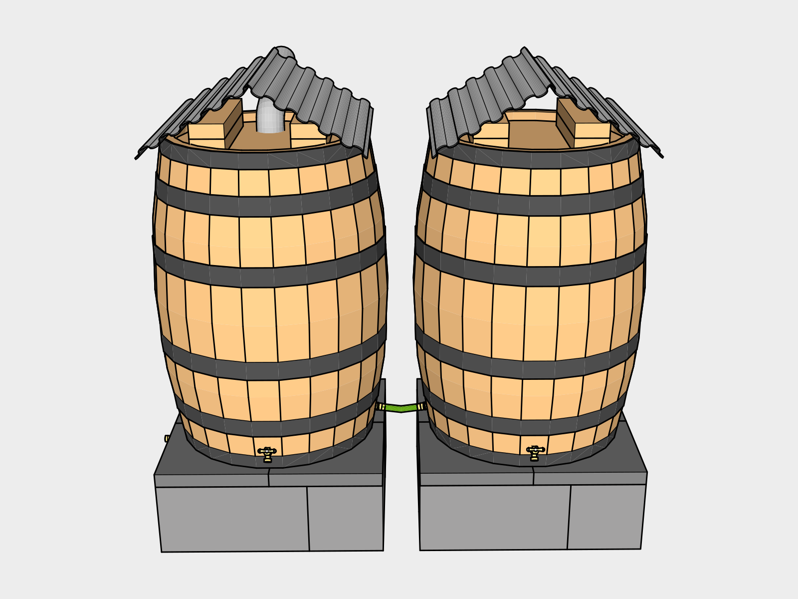

# Additional Barrels

To expand storage capacity you can daisy chain barrels by adding a _Brass Garden Hose Adapter_ on the bottom side of a barrel. Attach the second barrel with an \*8” Linking Hose”. The second barrel is the same design without the downspout hole or overflow needed.

By attaching the barrels at the bottom, as the barrel attached to the gutter fills, it will slowly drain into the other barrel, keeping both full and wet inside. When wooden barrels dry out the boards will begin to separate. If you see this happening during a dry spell, it's best to refill the barrels using whatever water you have. We stick a garden hose in our gutters until the barrels begin to leak excessively when this happens.

## Existing Supplies from First Barrel

You should have enough steel roofing to make 3 more barrels.

| Item                                          | Use  |
| --------------------------------------------- | ---- |
| 2'x 8' Corrugated Galvanized Steel Roof Panel | Roof |
| 1 1/4" Wafer-Head Screws                      | Roof |

## Supplies for Adding a Barrel

| Item                        | Use      | #           | Cost       | Total  |
| --------------------------- | -------- | ----------- | ---------- | ------ |
| 8 inch Linking Hose         | Linking  |             |            | 12.95  |
| Brass Garden Hose Adapter   | Overflow | 2           | 4.93       | 9.86   |
| All Purpose Gravel          | Riser    | 1 50 lb Bag |            | 3.85   |
| Cinder Blocks               | Riser    | 4           | 1.65       | 6.60   |
| 12"x12" Paver stones        | Riser    | 4           | 1.52       | 6.08   |
| Used Oak Barrel             |          | 1           |            | 100.00 |
| 2x4x8                       | Roof     | 1           |            | 3.13   |
| 2.5" Stainless Steel Screws | Roof     | 15 pack     |            | 7.79   |
| Brass Hose Spigot / Bibb    | Spigot   | 1           |            | 8.58   |
| **Total**                   |          |             | **158.84** |        |
