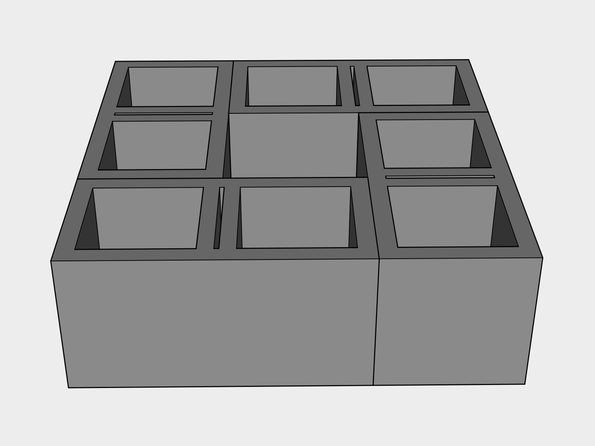
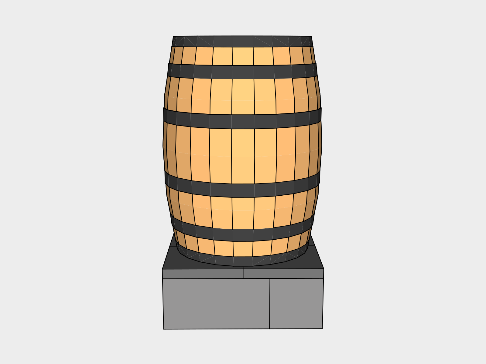
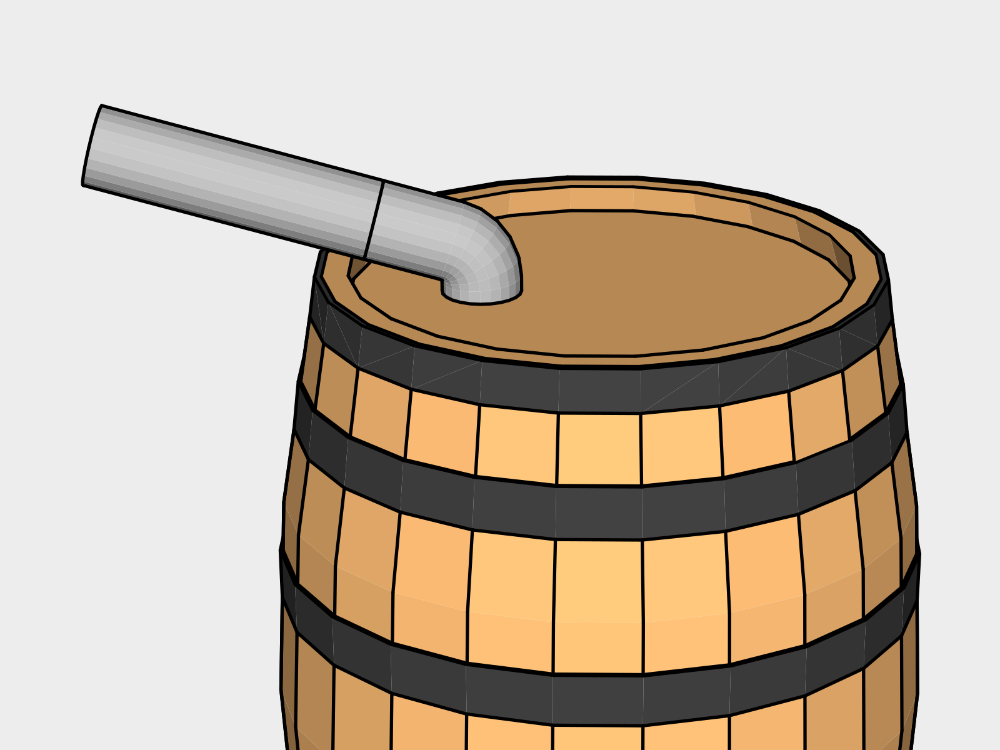

# Water Barrel - $222

This design is for watering plants, not for potable drinking storage. It's free of paint and can be built using only battery powered tools.

| | Tools | Supplies | Total |
|---|---|---|
| First Barrel | 77.45 | 222.33 | 299.78 |
| Add a Barrel | -- | 158.84 | 158.84 |

### Plastic Free Goal
Wooden barrels are used rather than the common blue or white plastic drums, the washers are black rubber, and the spigot and overflow are made of brass. The only plastic in use in this design currently is the vinyl hose, which we hope to solve for soon.

## 1. Gravel Base

Using a *Flat Shovel* clear a 2' x 2' pad where you'd like the barrel to be. Lay a layer of *All Purpose Gravel* down in the clearing to help you level the blocks in the next step.

## 2. Riser

A riser is used to give you enough space to fit a watering can underneath.

Place four *Cinder Blocks* down as shown to form a 2' x 2' square and *Level* each block.

Lay four 1' x 1' *Paver Stones* on top to create a finished surface. 

## 3. Barrel

You can find used oak barrels at breweries, vineries, wineries, and distilleries. The price can varies based on availability and are, but they usually run about $100-200.

Use a *Tape Measurer* to mark about 1/3 of the way from the back to the front of *Barrel*. Drill a 3 inch hole using a *Battery Powered Drill* loaded with a *3" hole saw* attached to a *Hole saw bit*.

## 4. Downspout Connection

Install a *3” Round 75 degree downspout corner* into the hole with the male end down. You can now run additional downspout to make your connection as needed. You will need to convert from your gutter size / style to 3 inch rounded gutter. Various adapters can be found online.

## 5. Roof

The roof helps keep the barrel dry and prevents water from pooling in the top.

Cut the 2x4x8 into 4 sections about 13-14” in length with a *Battery Powered Circular Saw*. Because barrel designs vary, you’ll want to experiment some with the length of these boards to find the right fit.

Cut a 2 foot section of a *2'x8' Corrugated Galvanized Steel Roof Panel* using a *Shears Attachment Accessory* attached to your *Battery Powered Driver*. Round  the corners using *Metal Shears*. Bend the section in half until it fits on top of the barrel while resting on the 2x4 sections. 

Now that it’s assembled make sure the sides are even and the roofing overlaps the barrel edge. Adjust until you find a comfortable fit, then remove the roofing.

Screw in the bottom boards first, and then the top two into them using a *Battery Powered Driver* and two *2.5" Stainless Steel Screws* per board.

Screw roof in twice on each side into the 2x4s using a *Battery Powered Driver* and *1 1/4" Wafer-Head Screws*.

## 6. Spigot

Drill a hole about half an inch above the bottom ring on the side you want the spigot on using a *59/64 Drill Bit* loaded into a *Battery Powered Drill*. Next thread the hole using a *3/4 in. Pipe Tap* and a *10" Adjustable Wrench*. Once threaded, screw the *Brass Hose Spigot* into the hole using the *10” Adjustable Wrench*.

It’s easier to flip the barrel upside to do this once it’s marked so the wrench doesn’t hit the ground and can full rotate when you’re tapping / threading.

## 7. Overflow

Assemble the overflow as shown with the *Brass Garden Hose Adapter* into the *Brass Garden Hose Wye*. Make sure to screw the hose footing into the Wye, not the smaller 3/4” threads. Remove the barb from the *Brass Garden Hose Barb Adapter* and insert a *Black Rubber Washer with Screen* with the screen facing outward.

Drill a hole about half an inch below the too ring on the side you want the overflow on using a *59/64 Drill Bit* loaded into a *Battery Powered Drill*. Next thread the hole using a *3/4 in. Pipe Tap* and a *10" Adjustable Wrench*. Once threaded, screw the assembled overflow into the hole.

Finally screw the *Leader Hose* onto the overflow adapter with a rubber washer with a screen in between to keep insects out.

## Maintenance

You will want to clean the overflow screens periodically.

## New Tools

| Item | Cost |
|---|---|
| 3" hole saw | 13.47 |
| Hole saw bit | 16.97 |
| 3/4 in. Pipe Tap & 59/64 Drill Bit Kit | 32.04 |
| 10" Adjustable Wrench | 14.97 |
| **Total** | **77.45** |

## Existing Tools

This guide assumes you have a basic tool set.

| Item | Guide |
|---|---|
| Flat Shovel | Shed |
| Level | Shed |
| Tape Measurer | Shed |
| Battery Powered Drill | Shed |
| Battery Powered Circular Saw | Shed |
| Speed Square | Shed |
| Battery Powered Driver | Shed |
| Shears Attachment Accessory | Shed |
| Metal Shears | Shed |

## Supplies

| Item | Use | # | Cost | Total |
|---|---|---|---|---|
| All Purpose Gravel | Riser | 1 50 lb Bag | | 3.85 |
| Cinder Blocks | Riser | 4 | 1.65 | 6.60 |
| 12"x12" Paver stones | Riser | 4 | 1.52 | 6.08 |
| Used Oak Barrel | | 1 | | 100.00 |
| 3” Round 75 degree downspout corner | Downspout Connection | 1 | | 10.73 |
| 2x4x8 | Roof | 1 | | 3.13
| 2.5" Stainless Steel Screws | Roof | 15 pack |   | 7.79
| 2'x 8' Corrugated Galvanized Steel Roof Panel | Roof | 1 | | 34.35 |
| 1 1/4" Wafer-Head Screws | Roof | 50 Pack |  | 2.21
| Brass Hose Spigot / Bibb | Spigot | 1 | | 8.58 |
| Brass Garden Hose Adapter | Overflow | 1 | | 4.93 |
| Brass Garden Hose Wye | Overflow | 1 | | 11.80 |
| Brass Garden Hose Barb Adapter | Overflow | 1 | | 11.93 |
| Hose Washers with Screen | Overflow | 2 Pack | | 2.38 |
| Leader Hose | Overflow | 1 | | 7.97 |
| **Total** | |||**222.33**

# Second Downspout Connection - $11  

A second downspout is needed from some designs where you need to run two sides of a small roof into the same barrel.

## Supplies for Second Downspout

| Item | Use | # | Cost | Total |
|---|---|---|---|---|
| 3” Round 75 degree downspout corner | Downspout Connection | 1 | | 10.73 |

# Add a Barrel - $159

To expand storage capacity you can daisy chain barrels by adding a *Brass Garden Hose Adapter* half an inch above the second ring from the top on the side of a barrel. Attach the second barrel with an *8” Linking Hose”. The second barrel is the same design without the downspout hole or overflow needed.

## Existing Supplies from First Barrel

You should have enough steel roofing to make 3 more barrels.

| Item | Use |
|---|---|
| 2'x 8' Corrugated Galvanized Steel Roof Panel | Roof |
| 1 1/4" Wafer-Head Screws | Roof |

## Supplies for Adding a Barrel

| Item | Use | # | Cost | Total |
|---|---|---|---|---|
| 8 inch Linking Hose | Linking | | | 12.95 |
| Brass Garden Hose Adapter | Overflow | 2 | 4.93 | 9.86 |
| All Purpose Gravel | Riser | 1 50 lb Bag | | 3.85 |
| Cinder Blocks | Riser | 4 | 1.65 | 6.60 |
| 12"x12" Paver stones | Riser | 4 | 1.52 | 6.08 |
| Used Oak Barrel | | 1 | | 100.00 |
| 2x4x8 | Roof | 1 | | 3.13
| 2.5" Stainless Steel Screws | Roof | 15 pack |   | 7.79
| Brass Hose Spigot / Bibb | Spigot | 1 | | 8.58 |
| **Total** | |||**158.84**
	 
