# Garden Waterbarrel
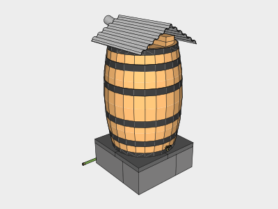

This design is for watering plants, not for drinking water. It's free of paint and can be built using only battery powered tools.

### Plastic Free - In Progress
Wooden barrels are used rather than the common blue or white plastic drums. The washers are black rubber. The spigot and vent are made of brass.

The only plastic in use in this design currently is the vinyl hose. We are seeking an alternative to this.

## 1. Crushed Stone
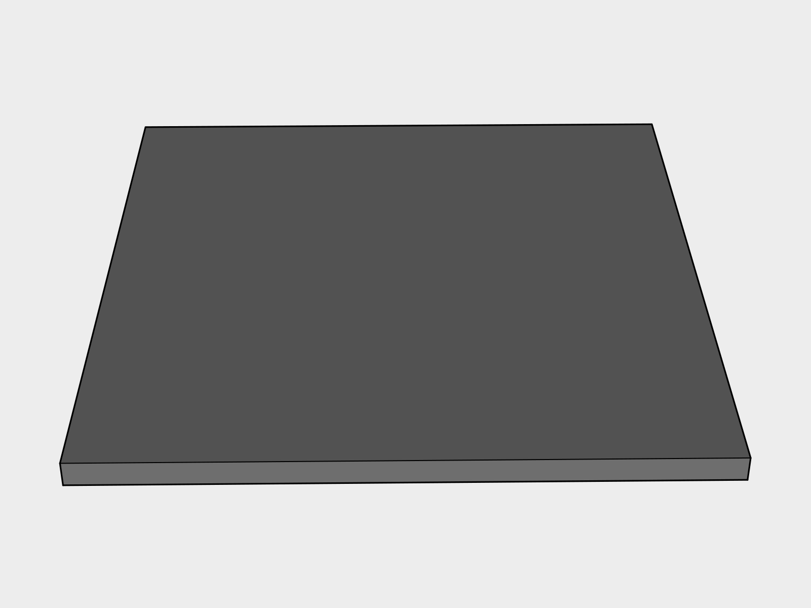

Using a *Flat Shovel* clear a 2' x 2' pad where you'd like the barrel to be. Lay an inch of *Crushed Stone* down in the clearing.

## 2. Raiser
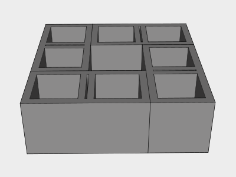

A raiser is used to give you enough space to fit a watering can underneath.

Place four *Cinder Blocks* down as shown to form a 2' x 2' square and *Level* each block.

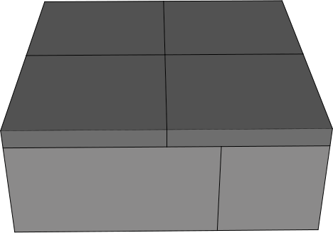

Lay four 1' x 1' *Paver Stones* on top to create a finished surface. 

## 3. Barrel
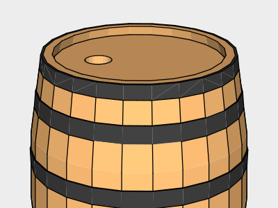

Use a *Tape Measurer* to mark the center of the top of the *Barrel*. Drill a 3 inch hole using a *Battery Powered Drill* loaded with a *3" hole bit*.

## 4. Downspout Connection
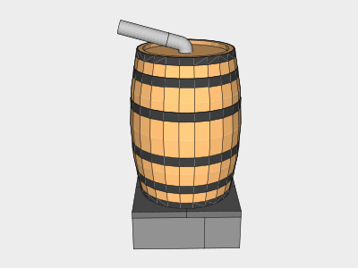

Install a *3” Round 75 degree downspout corner* into the hole with the male end down. You can now run additional downspout to make your connection as needed. You will need to convert from your gutter size / style to 3 inch rounded gutter. Various adapters can be found online.

## 5. Roof
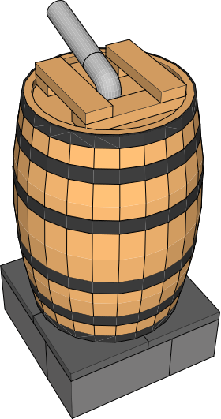

The roof helps keep the barrel dry and prevents water from pooling in the top.

Cut the 2x4x8 into three 2x4x13.5" sections and two 2x4x3.5" sections using a *Battery Powered Circular Saw*. Lineup the boards on top of the barrel and square them using a *Speed Square*. Screw in the bottom boards first, and then the top two into them using a *Battery Powered Driver* and two *2.5" Stainless Steel Screws* per board.

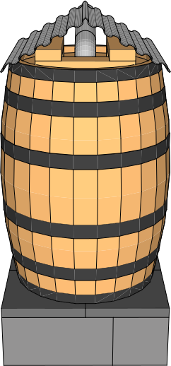

Cut a 2 foot section of a *2'x8' Corrugated Galvanized Steel Roof Panel*. Bend the section in half until it fits on top of the barrel while resting on the 2x4 sections. Screw roof in twice on each side into the 2x4s using a *Battery Powered Driver* and *1 1/4" Wafer-Head Screws*.

## 6. Spigot
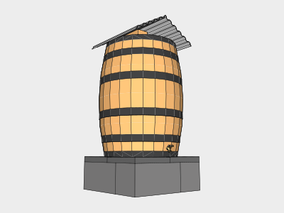

Drill a hole about half an inch above the bottom ring on the side you want the spigot on using a *59/64 Drill Bit* loaded into a *Battery Powered Drill*. Next thread the hole using a *3/4 in. Pipe Tap* and a *10" Adjustable Wrench*. Once threaded, screw the *Brass Hose Spigot* into the hole using the *10” Adjustable Wrench*.

## 7. Overflow
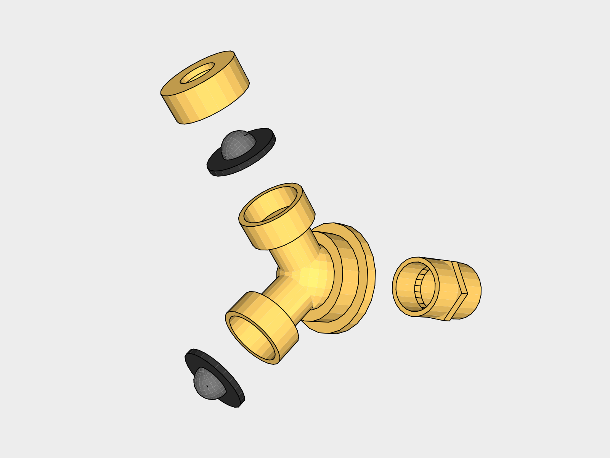

Assemble the overflow as shown with the *Brass Garden Hose Adapter* into the *Brass Garden Hose Wye*. Remove the barb from the *Brass Garden Hose Barb Adapter* and insert a *Black Rubber Washer with Screen* with the screen facing outward.

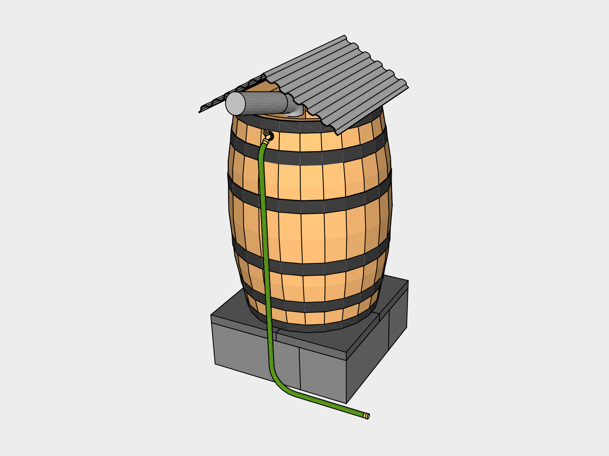

Drill a hole about half an inch below the too ring on the side you want the overflow on using a *59/64 Drill Bit* loaded into a *Battery Powered Drill*. Next thread the hole using a *3/4 in. Pipe Tap* and a *10" Adjustable Wrench*. Once threaded, screw the assembled overflow into the hole.

Finally screw the *Leader Hose* onto the overflow adapter with a rubber washer with a screen in between to keep insects out.

## Maintenance

You will want to clean the overflow screens periodically.

## Tools

| Item | Cost |
|---|---|
| Flat Shovel |
| Level |
| Tape Measurer |
| Battery Powered Drill |
| 3" hole bit |
| Battery Powered Circular Saw |
| Speed Square |
| Battery Powered Driver |
| 59/64 Drill Bit |
| Battery Powered Drill |
| 3/4 in. Pipe Tap |
| 10" Adjustable Wrench |
| 59/64 Drill Bit |
| Battery Powered Drill |
| 3/4 in. Pipe Tap |
| 10" Adjustable Wrench |

## Supplies

| Item | Use | # | Cost | Total |
|---|---|---|---|---|
| Crushed Stone |
| Cinder Blocks |
| Paver stones |
| Barrel |
| 3” Round 75 degree downspout corner |
| 2x4x8 |
| 2.5" Stainless Steel Screws |
| 2'x8' Corrugated Galvanized Steel Roof Panel |
| 1 1/4" Wafer-Head Screws |
| Brass Hose Spigot |
| Brass Garden Hose Adapter |
| Brass Garden Hose Wye |
| Brass Garden Hose Barb Adapter |
| Black Rubber Washer with Screen |
| Leader Hose |

## Expansion

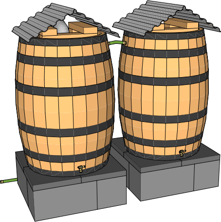

To expand storage capacity you can daisy chain barrels by adding a *Brass Garden Hose Adapter* half an inch above the second ring from the top on the side of a barrel. Attach the second barrel with an *8” hose”. The second barrel is the same design without the downspout hole or overflow needed.