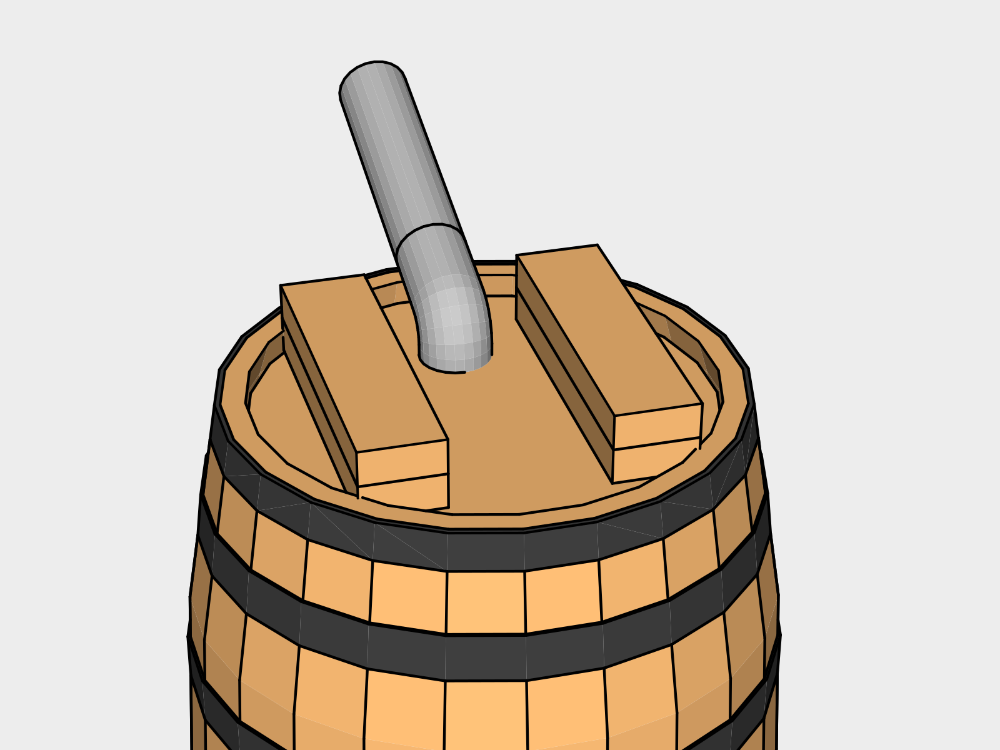
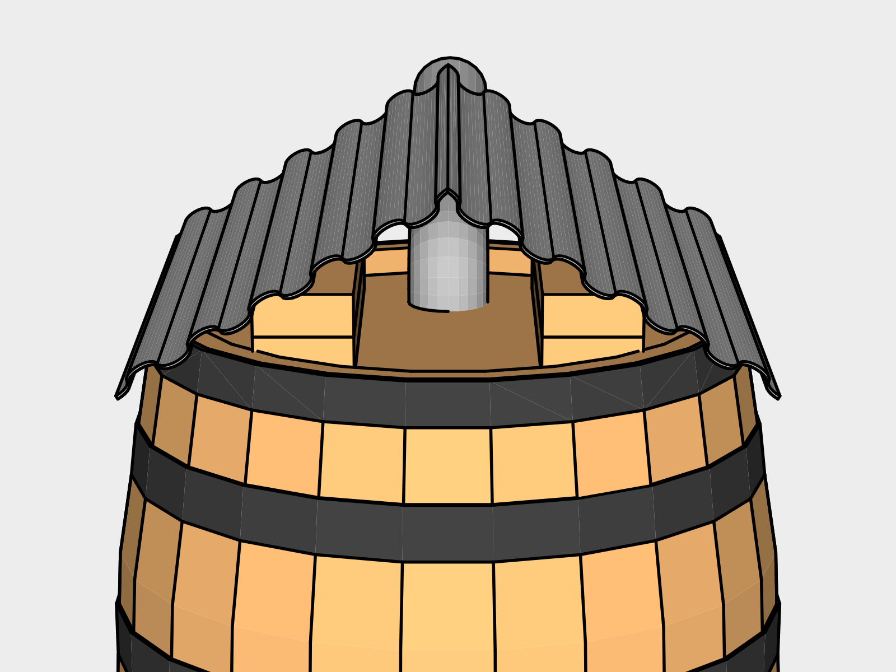
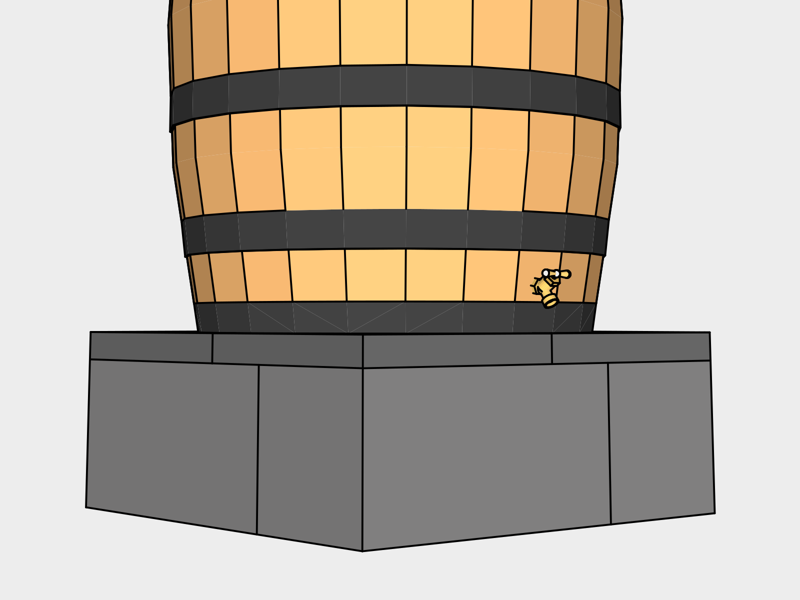

# Garden Water Barrel

This design is for strain water for watering plants, not for drinking. It's free of paint and can be built using only battery powered tools.

### Plastic Free - In Progress
Wooden barrels are used rather than the common blue or white plastic drums. The washers are black rubber. The spigot and vent are made of brass.

The only plastic in use in this design currently is the vinyl hose. We are seeking an alternative to this.

## 1. Gravel Base

Using a *Flat Shovel* clear a 2' x 2' pad where you'd like the barrel to be. Lay a layer of *All Purpose Gravel* down in the clearing to help you level the blocks in the next step.

## 2. Riser

A riser is used to give you enough space to fit a watering can underneath.

Place four *Cinder Blocks* down as shown to form a 2' x 2' square and *Level* each block.

Lay four 1' x 1' *Paver Stones* on top to create a finished surface. 

## 3. Barrel

Use a *Tape Measurer* to mark the center of the top of the *Barrel*. Drill a 3 inch hole using a *Battery Powered Drill* loaded with a *3" hole saw* attached to a *Hole saw bit*.

## 4. Downspout Connection

Install a *3” Round 75 degree downspout corner* into the hole with the male end down. You can now run additional downspout to make your connection as needed. You will need to convert from your gutter size / style to 3 inch rounded gutter. Various adapters can be found online.

## 5. Roof

The roof helps keep the barrel dry and prevents water from pooling in the top.

Cut the 2x4x8 into three 2x4x13.5" sections and two 2x4x3.5" sections using a *Battery Powered Circular Saw*. Lineup the boards on top of the barrel and square them using a *Speed Square*. Screw in the bottom boards first, and then the top two into them using a *Battery Powered Driver* and two *2.5" Stainless Steel Screws* per board.

Cut a 2 foot section of a *2'x8' Corrugated Galvanized Steel Roof Panel*. Bend the section in half until it fits on top of the barrel while resting on the 2x4 sections. Screw roof in twice on each side into the 2x4s using a *Battery Powered Driver* and *1 1/4" Wafer-Head Screws*.

## 6. Spigot

Drill a hole about half an inch above the bottom ring on the side you want the spigot on using a *59/64 Drill Bit* loaded into a *Battery Powered Drill*. Next thread the hole using a *3/4 in. Pipe Tap* and a *10" Adjustable Wrench*. Once threaded, screw the *Brass Hose Spigot* into the hole using the *10” Adjustable Wrench*.

## 7. Overflow

Assemble the overflow as shown with the *Brass Garden Hose Adapter* into the *Brass Garden Hose Wye*. Remove the barb from the *Brass Garden Hose Barb Adapter* and insert a *Black Rubber Washer with Screen* with the screen facing outward.

Drill a hole about half an inch below the too ring on the side you want the overflow on using a *59/64 Drill Bit* loaded into a *Battery Powered Drill*. Next thread the hole using a *3/4 in. Pipe Tap* and a *10" Adjustable Wrench*. Once threaded, screw the assembled overflow into the hole.

Finally screw the *Leader Hose* onto the overflow adapter with a rubber washer with a screen in between to keep insects out.

## Maintenance

You will want to clean the overflow screens periodically.

## New Tools

| Item | Cost |
|---|---|
| 3" hole saw | 13.47 |
| Hole saw bit | 16.97 |
| 3/4 in. Pipe Tap & 59/64 Drill Bit Kit | 32.04 |
| 10" Adjustable Wrench | 14.97 |
| **Total** | **77.45** |

## Existing Tools

| Item | Guide |
|---|---|
| Flat Shovel | Shed |
| Level | Shed |
| Tape Measurer | Shed |
| Battery Powered Drill | Shed |
| Battery Powered Circular Saw | Shed |
| Speed Square | Shed |
| Battery Powered Driver | Shed |

## Supplies

| Item | Use | # | Cost | Total |
|---|---|---|---|---|
| All Purpose Gravel | Riser | 1 50 lb Bag | | 3.85 |
| Cinder Blocks | Riser | 4 | 1.65 | 6.60 |
| 12"x12" Paver stones | Riser | 4 | 1.52 | 6.08 |
| Used Oak Barrel | | 1 | | 100.00 |
| 3” Round 75 degree downspout corner | Downspout Connection | 1 | | 10.73 |
| 2x4x8 | Roof | 1 | | 3.13
| 2.5" Stainless Steel Screws | Roof | 15 pack |   | 7.79
| 2'x 8' Corrugated Galvanized Steel Roof Panel | Roof | 1 | | 34.35 |
| 1 1/4" Wafer-Head Screws | Roof | 50 Pack |  | 2.21
| Brass Hose Spigot / Bibb | Spigot | 1 | | 8.58
| Brass Garden Hose Adapter | Overflow | 1 | 
| Brass Garden Hose Wye | Overflow | 1 | 
| Brass Garden Hose Barb Adapter | Overflow | 1 | 
| Black Rubber Washer with Screen | Overflow | 1 | 
| Leader Hose | Overflow | 1 | 

## Expansion

To expand storage capacity you can daisy chain barrels by adding a *Brass Garden Hose Adapter* half an inch above the second ring from the top on the side of a barrel. Attach the second barrel with an *8” hose”. The second barrel is the same design without the downspout hole or overflow needed.