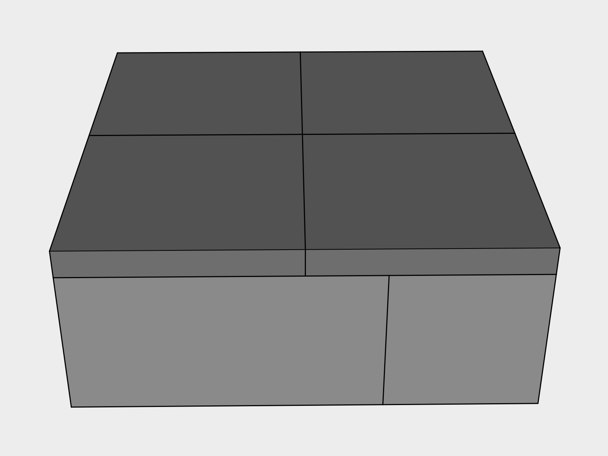
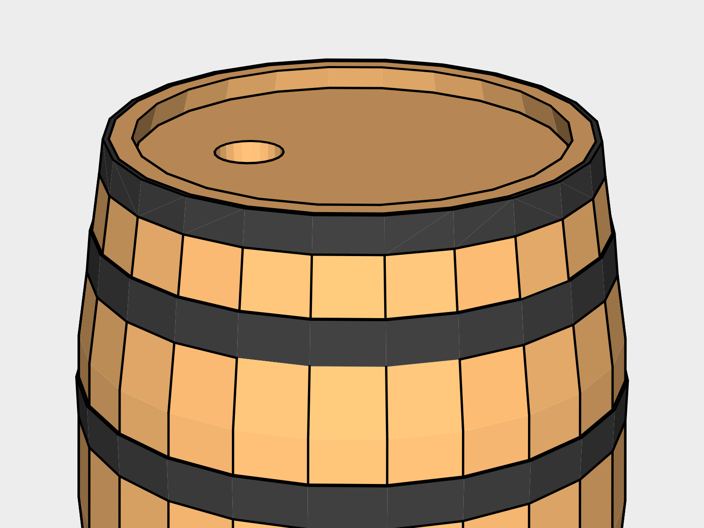

# Garden Waterbarrel

This design is for watering plants, not for drinking water.

## Goals

This design 

### Plastic Free - In Progress
Wooden barrels are used rather than the common blue or white plastic drums. The washers are black rubber.

The only plastic in use in this design currently is the vinyl hose.

## 1. Crushed Stone

Using a *Flat Shovel* clear a 2' x 2' pad where you'd like the barrel to be. Lay an inch of *Crushed Stone* down in the clearing.

## 2. Raiser

A raiser is used to give you enough space to fit a watering can underneath.

Place four *Cinder Blocks* down as shown to form a 2' x 2' square and *Level* each block.

Lay four 1' x 1' Paver stones on top to create a finished surface. 

## 3. Barrel

Use a *Tape Measurer* to mark the center of the top of the barrel. Drill a 3 inch hole using a *Battery Powered Drill* loaded with a *3" hole bit*.

## 4. Downspout Connection

Install a *75 degree downspout corner* into the hole with the male end down.
You can now run additional downspout to make your connection as needed.

## 5. Roof

Cut three 2x4x13.5" sections and two 2x4x3.5" sections using a *Battery Powered Circular Saw*.

## 6. Spigot

## 7. Overflow

## Maintenance

## Tools

## Supplies

## Expansion

